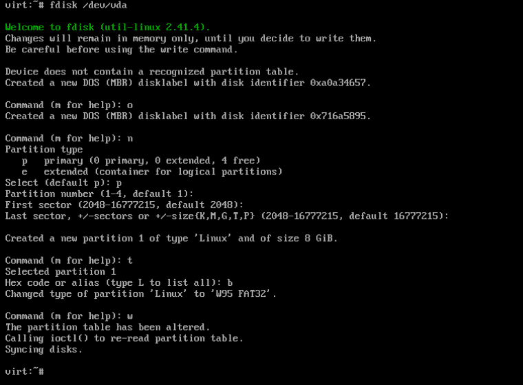
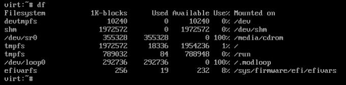
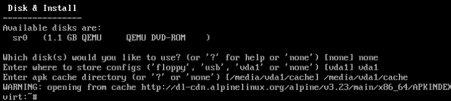

#+TITLE: Alpine Linux 'diskless' install | kris.sh
#+OPTIONS: toc:nil num:nil author:nil timestamp:nil

#+BEGIN_EXPORT html
<h2>Alpine Linux 'diskless' install</h2>
<time datetime="2026-04-12T05:27:24-05:00">April 12, 2026</time> - Linux
#+END_EXPORT

Alpine Linux is an interesting distribution- it's incredibly small, uses a solid software stack, and I seem to be unable to stop making posts about it.

One interesting thing that can be done with Alpine is a "diskless" installation- that being an installation where the system is loaded into RAM on startup, and runs there until the system shuts down.

In addition, by default, none of the changes made to this in-RAM system will be saved to the actual disk on the system, making it "amnesic." This is particularly useful for applications where one may /not/ want changes/logs/etc to be saved to the disk (such as for a VPN gateway/host). Of course, changes can be explicitly committed to the disk- otherwise, it would be pretty much impossible to make a useful system out of this.

In my case, I have acquired a Dell Wyse 3040 N10D thin client- a system that has 8G of soldered EMMC storage with no decent ways to expand. Given how notoriously fragile EMMC is, let alone how slow it is, running a system from the 2G of memory this system has suddenly looks extremely appealing in order to touch the EMMC *as little as possible.*

Precursory information as to why I've done this aside, here's how this can be set up:

* Diskless Alpine Installation
:PROPERTIES:
:CUSTOM_ID: diskless-alpine-installation
:END:
This guide assumes you've already written an Alpine live ISO to a flash drive/dvd/otherwise, and have booted it up.

First, log into the installation media- we're going to use the default Alpine ISO utilities to deploy the system.

Once logged in, run the =setup-alpine= script as per usual (I'm not going to cover this in the guide, it's well documented external to this, including in other posts on my blog).

Proceed through the installation process as per usual until you've chosen an =apk= mirror, and hit =Ctrl+C= to quit the installer- we will continue with that later. The point of this is to configure a few of the basics like networking in the live environment.

Once you've exited the Alpine installer, we need to install a few utilities via: =apk add util-linux wipefs lsblk=, =wipefs= here is optional if the internal storage is already *completely* blank, but it's always best to make sure regardless. =util-linux= will provide us with =fdisk= so we can format the internal drive.

Next, run =lsblk= and figure out what disk you're going to turn into your diskless boot drive- for this guide I am going to assume =/dev/vda=.

In order to wipe the disk, you may run =wipefs --all /dev/vda=. *BE AWARE*, this will completely wipe the drive- back up anything on it you may want to keep beforehand (though, please try to avoid storing important data on EMMC if you can avoid it).

Once your disk has been nuked, run =fdisk /dev/vda= and create a partition table. After the partition table has been created, you may create a single FAT32 partition- this is where your boot files and configuration will live.

The key combination I've used to do this is as follows: =o n p <enter> <enter> <enter> t b w=, as shown below:

This key combination will create a partition table, a primary partition to hold your boot files, and set the type to W95 FAT32.

After exiting =fdisk=, we need to format the new partition- this can be done with: =mkfs.vfat /dev/vda1=, again, adjusting for the drive/partition that applies to you.

Next, we need to figure out where the installation media is mounted- you can find this information by running =df= as shown below:

In my case, the live media is =/media/cdrom=.

Now, to actually deploy the system to the "diskless" boot drive, we're going to use Alpine's =setup-bootable= script. The syntax is as follows: =setup-bootable <live_system> <target>=

=<target>= in this case is the drive we want to deploy to, so in my case, the correct command would be: =setup-bootable /media/cdrom /dev/vda1=.

Once you've done this, you're free to shut the system down and pull your live media. The system should now start off of the "diskless" boot drive.

* Configuring a new diskless Alpine installation
:PROPERTIES:
:CUSTOM_ID: configuring-a-new-diskless-alpine-installation
:END:
You may notice upon booting that the system is almost identical to the live media you just removed- because it pretty much is.

Now that the system has started off of the "new" installation, run =setup-alpine= again. This time, we will be going through it to completion as you would with a normal Alpine installation- but with a few important differences.

Once making it to the point in the Alpine installer that you're asked to select a disk, you should enter =none=. After doing this, the installer will prompt us to enter locations for storing configs- one of these should be the disk we've just booted from, and one will be a directory on the same disk to store =apk= cache.

Configure as follows, replacing the values with ones that apply to your system:

Ignore the error about =apk= cache here, this will be solved when you run =apk update= on the new system and commit that change.

Once you've finished this, run =lbu commit= to make your configuration save to disk to be loaded on the next startup. This command should be kept in mind- if you make any changes to the new system, they will not persist across boots unless you commit them to the disk like this.

Congrats your new diskless Alpine install!

* Notes on lbu and disk commits
:PROPERTIES:
:CUSTOM_ID: notes-on-lbu-and-disk-commits
:END:
By default, there are some directories that aren't tracked by =lbu=, namely =/home= and =/root=. Of course, this can be an issue if you set up a normal user- luckily this is very easy to fix.

In order to add directories to be captured in your disk commits, run =lbu add /dir=, replacing =/dir= with the directory you would like to add, such as =/home=.

Important configuration directories such as =/etc= should be captured in your disk commits by default.

* Editing kernel parameters
:PROPERTIES:
:CUSTOM_ID: editing-kernel-parameters
:END:
In order to configure kernel parameters on your new system, you'll have to mount the disk as read/write as opposed to read-only. To do this, you can simply run =mount -o remount,rw /media/vda1=, replacing =vda1= with your partition. Once you've done this, you can open up =/media/vda1/boot/grub/grub.cfg= in a text editor and configure your kernel parameters to your heart's content (Alpine includes =vi= by default).

After editing, simply run: =sync && mount -o remount,ro /media/vda1= to put things back how they were, and then reboot the system to see them applied as per usual.

* Closing thoughts
:PROPERTIES:
:CUSTOM_ID: closing-thoughts
:END:
I don't have any, but this section seems to always exist. Have fun with your new install.
