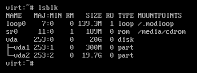
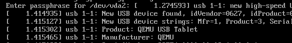
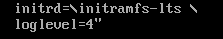
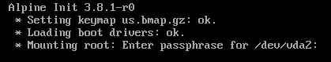

#+TITLE: Alpine Linux with efistub and encryption | kris.sh
#+OPTIONS: toc:nil num:nil author:nil timestamp:nil

#+BEGIN_EXPORT html
<h2>Alpine Linux with efistub and encryption</h2>
<time datetime="2024-01-01T19:01:33-06:00">January 1, 2024</time> - Linux, UEFI
#+END_EXPORT

The Linux kernel can be booted directly by the UEFI firmware, making a traditional bootloader like GRUB not necessary in many cases.

In this post, we're going to set up an Alpine Linux system that uses both efistub and LVM on LUKS.

To begin, I assume you've already booted into an Alpine Linux live system via a USB flash drive, CD, or otherwise.

* Modifying the Alpine installer
:PROPERTIES:
:CUSTOM_ID: modifying-the-alpine-installer
:END:
By default, Alpine deploys a typical bootloader, but we can set a variable in the install script to skip installing a bootloader and then chroot into the new system to configure efistub.

Open the =/sbin/setup-disk= script in a text editor such as =vi= and add =BOOTLOADER="none"= like so:

[[file:images/setup-disk-image.png]]

After this, save the file and continue installing Alpine Linux as you normally would, with the =setup-alpine= command. Be sure to configure the disk with encryption and LVM.

* Mounting partitions
:PROPERTIES:
:CUSTOM_ID: mounting-partitions
:END:
After installing, we need to mount the root partition to =/mnt= so that we can chroot into it before first boot.

On the live Alpine system, I'm going to install =lsblk= to get a list of disks and partitions with =apk add lsblk=.
After this, run =lsblk= to see a list of disks and partitions, in my case:

We need to unlock our new encrypted partition, to do so run =cryptsetup luksOpen /dev/vda2 cryptroot=, replacing =/dev/vda2= with your drives encrypted partition and =cryptroot= with what you would like to name it, and then enter your encryption passphrase.

Next, run =vgchange -ay= to activate logical volumes. Then, after running =lsblk= again, we can see our logical volumes containing the root and swap:

[[file:images/lsblk-output-image2.png]]

We now need to mount our =lv_root= to =/mnt=. To do so, run =mount /dev/mapper/vg0-lv_root /mnt=.
We also need to mount our boot partition, =mount /dev/vda1 /mnt/boot= in my case.

There are a few more directories that should be mounted before we do anything, condensed into a one-line command:

=for dir in dev proc sys run; do mkdir -p /mnt/$dir ; mount --rbind /$dir /mnt/$dir ; mount --make-rslave /mnt/$dir ; done=

After that, we can chroot into our new system with =chroot /mnt= and begin setting up efistub.

* Creating the efistub boot entry
:PROPERTIES:
:CUSTOM_ID: creating-the-efistub-boot-entry
:END:
For this, we're going to need our encrypted partitions UUID to create a robust boot entry.

One way of accomplishing this is running =blkid -o value -s UUID /dev/vda2= and noting down its output. Do change the =/dev/vda2= part of this command according to your setup.

To create the efistub boot entry, we will create a script to generate it for us.

First, we need to install the =efibootmgr= package. Run =apk add efibootmgr=.

Then, change directories with =cd /root=, and then =vi setup-bootentry.sh= to begin creating this script. Do feel free to replace =vi= with another text editor if you prefer.

Contents of the script:

#+begin_src sh
#!/bin/sh

params="cryptroot=UUID=<UUID> cryptdm=cryptroot \
    root=/dev/mapper/vg0-lv_root rootfstype=ext4 rw \
    initrd=\intel-ucode.img \
    initrd=\initramfs-lts"

efibootmgr --create --label "Alpine Linux" \
    --disk /dev/vda --part 1 \
    --loader /vmlinuz-lts \
    --unicode "${params}" \
    --verbose
#+end_src

=params= is our list of kernel parameters, while the =efibootmgr= command is what creates our boot entry.

Replace =<uuid>= in the =cryptroot=UUID=<uuid>= line with the UUID of the partition we got earlier from the =blkid= command.

Replace =cryptroot= in the =cryptdm=cryptroot= line with what you would like to name this. I used =cryptroot= earlier when we opened our LUKS partition, and I will go with that again here.

Change =initrd=\intel-ucode.img= according to what kind of CPU you have, if you would like. You may also remove this line.

Change =--disk /dev/vda= according to your setup, pointing at the disk that contains our =/boot= partition and our LUKS encrypted partition.

If you are using another filesystem, such as xfs, be sure to change =rootfstype=ext4= accordingly, such as to =rootfstype=xfs=.

Once finished creating the script, save the file. We need to mark the script as executable by running =chmod +x setup-bootentry.sh=, and then we can execute it with =./setup-bootentry.sh=

Now, if we run =efibootmgr=, we should see a new boot entry with the label defined in our script, =Alpine Linux=.

* Finalizing
:PROPERTIES:
:CUSTOM_ID: finalizing
:END:
To exit the chroot, run =exit=. We can now reboot the system with =reboot now=, be sure to remove any live media so you don't boot into the wrong system.

If all went well, our system should begin booting (with a lot of noise) and prompt us for our encryption passphrase:

After entering the encryption passphrase, we should be booted into the new Alpine system.

If you would like to quiet down the logs during boot, we can add the =loglevel=4= kernel parameter to our script at =/root/setup-bootentry.sh=, adding another backslash after the previous parameter:

And then creating another boot entry.

Before executing the script again, remove the old boot entry with =efibootmgr -b 0004 -B=, replacing =0004= with the number of the old boot entry. The current boot entries can once again be listed by running =efibootmgr=.

Then, execute the script again with =./setup-bootentry.sh=.

After rebooting, we can see that the output is much quieter:

That's it!
