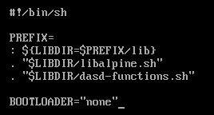
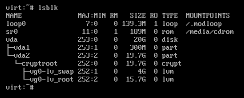

#+TITLE: Alpine Linux encrypted UKI install | kris.sh
#+OPTIONS: toc:nil num:nil author:nil timestamp:nil

#+BEGIN_EXPORT html
<h2>Alpine Linux encrypted UKI install</h2>
<time datetime="2024-01-24T10:24:59-06:00">January 24, 2024</time> - Linux, UEFI
#+END_EXPORT

Continuing with my trend of discussing UEFI related topics, today we will be setting up Alpine Linux with encryption and a UKI.

UKI stands for Unified Kernel Image, and it is a single file that will contain our initramfs (which will include CPU microcode if applicable), kernel, kernel parameters, and our os-release information.

This gives us a /single/ file to sign for secure boot, and provides better security compared to running a normal efistub setup with secure boot.

To begin, I assume you've already booted into an Alpine Linux live system via a USB flash drive, CD, or otherwise.

* Modifying the Alpine installer
:PROPERTIES:
:CUSTOM_ID: modifying-the-alpine-installer
:END:
By default, Alpine deploys a typical bootloader, but we can set a variable in the install script to skip installing a bootloader and then chroot into the new system to configure our UKI and boot entry.

Open the =/sbin/setup-disk= script in a text editor such as =vi= and add =BOOTLOADER="none"= like so:

After this, save the file and continue installing Alpine Linux as you normally would, with the =setup-alpine= command. Be sure to configure the disk with encryption and LVM.

* Mounting partitions
:PROPERTIES:
:CUSTOM_ID: mounting-partitions
:END:
After installing, we need to mount the root partition to =/mnt= so that we can chroot into it before first boot.

On the live Alpine system, I'm going to install =lsblk= to get a list of disks and partitions with =apk add lsblk=.
After this, run =lsblk= to see a list of disks and partitions, in my case:

[[file:images/lsblk-output-image1.png]]

We need to unlock our new encrypted partition, to do so run =cryptsetup luksOpen /dev/vda2 cryptroot=, replacing =/dev/vda2= with your drives encrypted partition and =cryptroot= with what you would like to name it, and then enter your encryption passphrase.

Next, run =vgchange -ay= to activate logical volumes. Then, after running =lsblk= again, we can see our logical volumes containing the root and swap:

We now need to mount our =lv_root= to =/mnt=. To do so, run =mount /dev/mapper/vg0-lv_root /mnt=.
We also need to mount our boot partition, =mount /dev/vda1 /mnt/boot= in my case.

There are a few more directories that should be mounted before we do anything, condensed into a one-line command:

=for dir in dev proc sys run; do mkdir -p /mnt/$dir ; mount --rbind /$dir /mnt/$dir ; mount --make-rslave /mnt/$dir ; done=

After that, we can chroot into our new system with =chroot /mnt= and begin building our initramfs.

* Building the new initramfs
:PROPERTIES:
:CUSTOM_ID: building-the-new-initramfs
:END:
If you do not want to include CPU microcode, feel free to skip this section.

Install the =intel-ucode=, =amd-ucode=, or otherwise applicable CPU microcode package with =apk add cpu-ucode=.

To build our new initramfs that includes our CPU microcode, run the following:

=cat /boot/intel-ucode.img /boot/initramfs-lts > /tmp/initramfs-lts=

Replacing =intel-ucode.img= as necessary (amd-ucode.img for AMD CPUs).

* Kernel parameters
:PROPERTIES:
:CUSTOM_ID: kernel-parameters
:END:
We need to put our kernel parameters into a file to later give our UKI. I'm going to place mine at =/root/kernelparams=, so run =vi /root/kernelparams= and begin adding kernel parameters.

*Your kernel parameters should not include an initrd parameter.*

I am going to include the following:

=cryptroot=UUID=<UUID> cryptdm=cryptroot root=/dev/mapper/vg0-lv_root rootfstype=ext4 rw=

=<UUID>= in the =cryptroot=UUID== line should be replaced by the UUID of the encrypted root partition. One way of getting the disks UUID is by running =blkid -o value -s UUID /dev/vda2= in my case, do replace =/dev/vda2= according to your setup.

Replace =cryptroot= in the =cryptdm=cryptroot= line with what you would like to name this. I used =cryptroot= earlier when we opened our LUKS partition, and I will go with that again here.

If you are using another filesystem, such as xfs, be sure to change =rootfstype=ext4= accordingly, such as to =rootfstype=xfs=.

If you would like a quiet output on boot, add =loglevel=4= to your kernel parameters.

Save and exit this file.

* Building the UKI
:PROPERTIES:
:CUSTOM_ID: building-the-uki
:END:
The necessary packages for this are =binutils= and =gummiboot-efistub=. =binutils= will provide =objcopy=, which we will be using to build our UKI, and =gummiboot-efistub= will provide our stub (don't worry, only this file, not the whole bootloader). These can be installed by running =apk add binutils gummiboot-efistub=.

Create a script with =vi build-uki.sh= and give it the following contents:

#+begin_src sh
#!/bin/sh

objcopy \
    --add-section .osrel="/etc/os-release" --change-section-vma .osrel=0x20000 \
    --add-section .cmdline="/root/kernelparams" --change-section-vma .cmdline=0x30000 \
    --add-section .linux="/boot/vmlinuz-lts" --change-section-vma .linux=0x40000 \
    --add-section .initrd="/tmp/initramfs-lts" --change-section-vma .initrd=0x3000000 \
    /usr/lib/gummiboot/linuxx64.efi.stub /boot/alpine.efi
#+end_src

This script will build our UKI with all of the necessary contents. If you placed your kernel parameter file elsewhere, do change the =.cmdline="/root/kernelparams"= line to point at your kernel parameter file.

If you chose not to include CPU microcode in your initramfs, point at the normal =/boot/initramfs-lts= file here instead of the one that would have been placed in =/tmp/initramfs-lts= if you included CPU microcode earlier.

To make this script executable, run =chmod +x build-uki.sh= and execute it with =./build-uki.sh=.

Once the UKI has been generated, we can create a boot entry that points at it with =efibootmgr=.

* Creating the boot entry
:PROPERTIES:
:CUSTOM_ID: creating-the-boot-entry
:END:
Install =efibootmgr= with =apk add efibootmgr=.

To create the boot entry, run the following command:

=efibootmgr --create --label "Alpine Linux" --disk /dev/vda --part 1 --loader "\alpine.efi"=

Be sure to replace =/dev/vda= according to your setup.

* Finalizing
:PROPERTIES:
:CUSTOM_ID: finalizing
:END:
Assuming all went well, you should be able to boot into the new Alpine Linux install via the UKI.

If you would like to use secure boot, follow the instructions on my [[/posts/sbctl-secure-boot/index.html][Secure Boot on Linux with sbctl]] post, signing *only* the UKI file we created in this post (=/boot/alpine.efi=).

If you would like, place all of the commands ran here into a single script to simplify this process.
