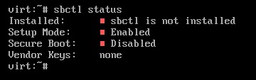
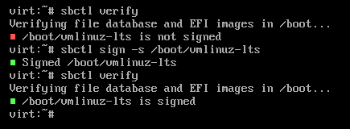
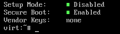

#+TITLE: Secure Boot on Linux with sbctl | kris.sh
#+OPTIONS: toc:nil num:nil author:nil timestamp:nil

#+BEGIN_EXPORT html
<h2>Secure Boot on Linux with sbctl</h2>
<time datetime="2024-01-17T17:35:10-06:00">January 17, 2024</time> - Linux, UEFI
#+END_EXPORT

Secure boot on Linux has always been a bit of a challenge, however Arch Linux developer Foxboron has created a very useful program called 'sbctl' which makes setting up secure boot extremely simple, boiling the process down to just a few commands.

The GitHub repository for sbctl can be found [[https://github.com/Foxboron/sbctl][here]].

* Preparing the system
:PROPERTIES:
:CUSTOM_ID: preparing-the-system
:END:
To begin, I assume you have a Linux distribution already set up and ready to use.

If you are using the GRUB bootloader, you will have to add the options =--modules="tpm"= and =--disable-shim-lock= to your =grub-install= command for this to work properly. Do consult GRUB documentation if you are unfamiliar with =grub-install= before continuing.

If you are using efistub, such as guided by my [[/posts/alpine-efistub-encryption/index.html][Alpine Linux with efistub and encryption]] post, no further configuration on the bootloader side of things is necessary.

Our system should have secure boot disabled and should be rebooted into setup mode. The process of rebooting into setup mode
does vary by motherboard, so do consult your motherboards manual or look around in your UEFI BIOS for an option to reboot the system into setup mode.

Once you have rebooted the system into setup mode, install the =sbctl= package according to your distribution of choice.

After installing sbctl, make sure the system is running in setup mode by running the =sbctl status= command, like so:

After verifying your system is in setup mode, we can begin setting up secure boot.

* Creating and enrolling secure boot keys
:PROPERTIES:
:CUSTOM_ID: creating-and-enrolling-secure-boot-keys
:END:
Begin by running =sbctl create-keys= to create your secure boot keys. This process may take a moment.

Once this has completed, run =sbctl enroll-keys= to enroll your secure boot keys. If you are prompted with red text saying Option ROM is present, there are a few options to continue.

The safest option to continue is to enroll using the Microsoft CA, though I have had great success by enabling TPM on my systems and using checksums from the TPM eventlog. *Do be very cautious here*, as there is a potential to soft-brick your hardware in the event that your GPU Option ROM cannot load, and due to this, you are unable to disable secure boot due to lack of a display output. Having a system with an iGPU could come in handy if this problem arises.

Regardless, once you have enrolled your secure boot keys, we need to make sure that all of the necessary files are signed using the =sbctl verify= command.

If you recieve the error =failed to find EFI system partition=, the path to your EFI partition can be specified manually by setting the =$ESP_PATH= variable. In my case, this error is solved by running =export ESP_PATH=/boot= as the root user.

If there are any unsigned files listed by this command, they can be signed manually by running =sbctl sign -s /path/to/unsigned/file= like so:

Once all necessary files are signed, it's time to reboot and enable secure boot.

* Finalizing
:PROPERTIES:
:CUSTOM_ID: finalizing
:END:
After rebooting with secure boot enabled, you can verify everything is correct by running =sbctl status=, and making sure that =Setup Mode= is disabled and =Secure Boot= is enabled like so:

If everything looks good, you're all set. Do remember to sign files again if necessary after system updates.

It may be worth looking into creating a UKI (Unified Kernel Image) if you're using an efistub setup.

If you're using GRUB, it may be worth looking into hardening GRUB itself to secure your boot process more.
